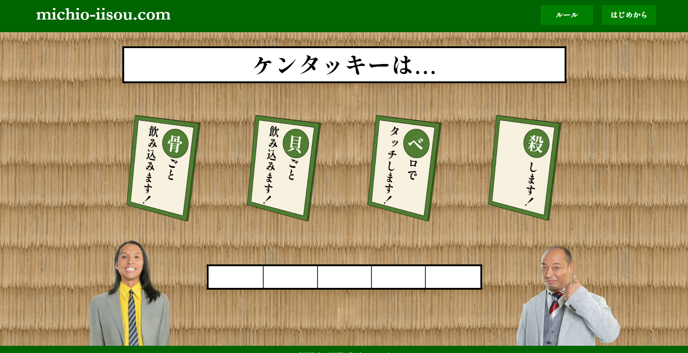

# mitio-iisou.com

HTML+CSS/JavaScript で構成

Play：https://and-2353.github.io/ThomBrowne/

## プレイ画面

## 修正点
- Twitter の組み込みの際常時設定になる ただし、リザルト時だけ表示にしたかったのでjsのinnerHTMLで組み込みにしようとしたらスタイルが失われた 常時ではない表示でちゃんとした体裁を保つ方法が分からなかったのでただのリンクになってる
- タイム計測にnextを押す時間も入っている, 1問目終了のnextから5問目にカルタのボタンを押すまで全ての時間が対象になってる 本当は問題に答えるだけの時間にしたほうがいい
- 上の修正時にスコアが以上に高くなる可能性があるので必要あれば修正

###スコアの算出
$$
w_3\log\frac{1}{2} (w_1t+w_2m)  \\ t=time(next(Q1)～button(Q5)) \\ m= number \, of \,mistake \\ w_1=\frac{1}{20} \\ w_2= \frac{1}{4} \\w_3 =100
$$
